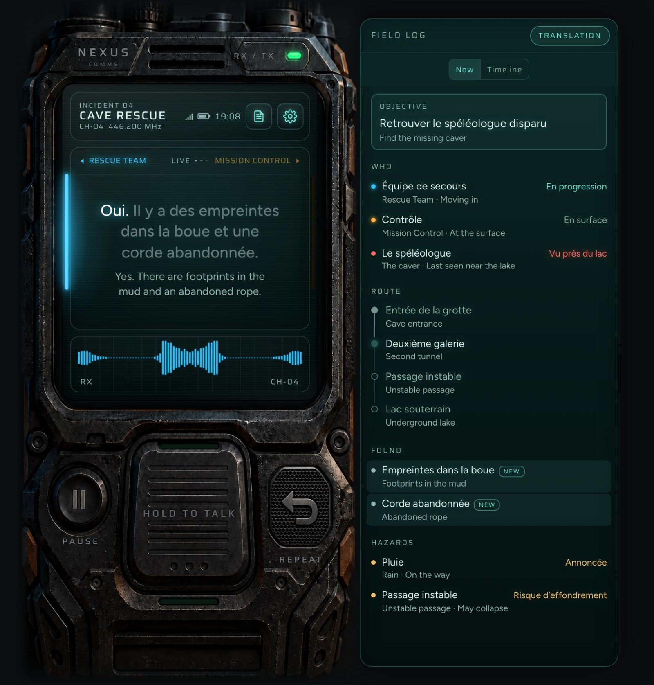
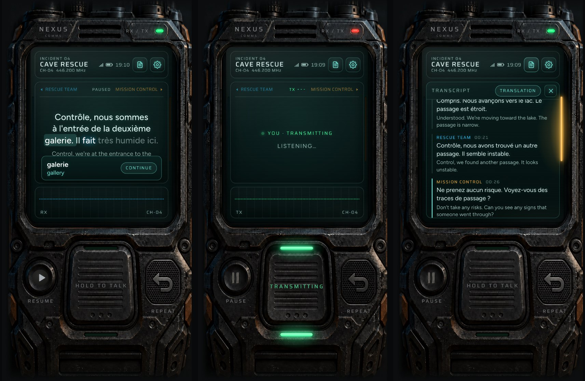
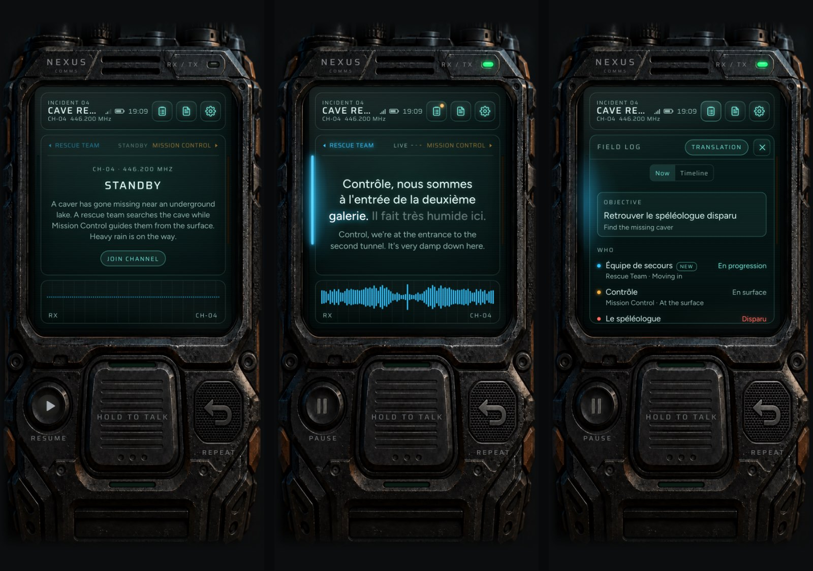
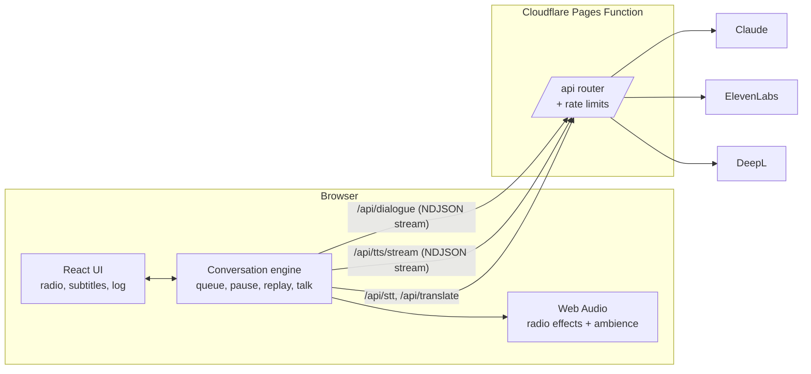

# Dawn Radio

**A live radio drama for language learners.** You tune in to a walkie-talkie channel where two characters handle an emergency in French. Claude writes the story as you listen, ElevenLabs voices it, and you can hold the talk key at any time to join in. The characters hear you and the story changes.

**Live demo:** https://dawn-radio.pages.dev



## What it does

- **A story written live.** Claude writes the next 4 radio lines at a time. Each line streams to the browser the moment it's written, so the first voice starts before the rest are done.
- **You're on the channel.** Hold the talk key and speak (in French, English, or a mix). The characters answer you, take your ideas seriously, and quietly repeat your message back in correct French, the way radio operators confirm a call.
- **Subtitles that follow the voice.** Every line shows French and English, and each word lights up as it's spoken, timed from ElevenLabs' character alignment.
- **Tap any word** to pause and see what it means in that sentence (DeepL, using the full line as context).
- **A field log that keeps itself up to date.** People, places, finds and hazards change as the story reveals them, with a timeline of key moments.
- **It sounds like a real radio.** A Web Audio chain adds a band-pass filter, distortion, hiss, squelch bursts and beeps. Each end of the channel has its own background (cave drips, control-room hum, rain), and weak signals crackle and drop out.
- **New channels from a short briefing.** Describe a situation ("a ferry loses its radar in fog"), pick a language and level, and Claude writes a new channel: characters, call signs, events, endings, voices and a field log. Channels stay in the browser's memory; tune between them or delete them from the channel list.
- **Picks up where you left off.** Reload or come back later and the channel waits on standby with a Resume button.
- **Works with no keys.** Without API keys it falls back to a fixed recording, the browser's own voice, and the browser's speech recognition.



<p align="center"><em>Left to right: a word lookup, transmitting with push-to-talk, and the transcript.</em></p>

## Built for phones too

The layout scales the radio to fit any screen. On narrow screens the field log moves inside the radio's screen; on wide screens it docks beside it. Touch, mouse and keyboard all work.



## Tech stack

| Layer | Tools |
| --- | --- |
| Front end | React 19, TypeScript, Vite, Motion, Web Audio API |
| Back end | Cloudflare Pages Functions (one router shared with the Vite dev server) |
| AI writing | Claude via the Anthropic SDK, streamed structured output (JSON schema) |
| Voice | ElevenLabs text-to-speech (streamed PCM with word timings) and Scribe speech-to-text |
| Translation | DeepL |
| Tooling | pnpm, oxlint, Wrangler, Git-based deploys |

## How it works



1. The engine asks `/api/dialogue` for the next batch, sending the story so far, the current field log, and anything the player said.
2. The server streams Claude's structured JSON reply. A small scanner pulls each finished line out of the half-written JSON array and sends it to the browser as one NDJSON row, so lines arrive one by one instead of all at the end.
3. While one line plays, the engine prepares the voice for the next line only. If the player cuts in, at most one line of voice work is wasted.
4. `/api/tts/stream` turns ElevenLabs' streamed audio and character timings into NDJSON chunks. The browser plays the audio as it arrives and maps character timings to words for the highlight.
5. Each line carries a field log update, applied the moment that line starts playing, so the log never gets ahead of the story.

## Engineering highlights

- **Low wait after you speak.** Streaming happens at every step: Claude's tokens, the lines, and the voice audio. On Claude Sonnet 5.5 with thinking off, the first reply line arrives in about 6 seconds; voice adds about 0.7 seconds.
- **Story memory that stays consistent.** Each reply returns an updated list of facts and a short summary. These go back with the next request, so the story stays coherent over a long session without sending the whole transcript.
- **Safe to put on a public URL.** The server only accepts known story IDs, so visitors can't send their own prompts. Player speech is treated as in-story chatter, never as instructions. Every API route has per-visitor rate limits.
- **One API, two runtimes.** The same `handleApi(request, env)` function serves `/api` in local development (as Vite middleware) and in production (as a Cloudflare Pages Function), including streamed responses and cancel signals.
- **Built to be reskinned.** The radio is drawn from rendered images with pixel positions in a config file, or entirely in CSS. Colors, fonts, party names, voices and the log layout all come from config, so a new story or look needs no component changes.
- **Graceful fallbacks.** Each service is optional. `/api/config` reports what's set up, and the app picks the best available option for writing, voice and speech recognition.

## What's next

- **Better radio graphics with Blender.** The radio is drawn from flat images in `public/skins/nexus/`. A 3D model of the radio in Blender would make it easy to render matching images for every state (each key pressed, lights on and off) at any size, with the same lighting. The new renders drop into a new skin config in `src/skins/`, with no component changes.

## Run locally

```bash
pnpm install
pnpm dev             # http://localhost:5173
```

Copy `.env.example` to `.env.local` and add your keys:

| Variable | What it turns on |
| --- | --- |
| `ANTHROPIC_API_KEY` | Live feed (Claude writes the dialogue) |
| `ELEVENLABS_API_KEY` | ElevenLabs voices and speech-to-text |
| `DEEPL_API_KEY` | Word lookups and translating your messages. Free keys (ending `:fx`) work. |

Optional:

| Variable | Default | Notes |
| --- | --- | --- |
| `CLAUDE_MODEL` | `claude-opus-5-5` | `claude-sonnet-5-5` replies faster |
| `CLAUDE_EFFORT` | `low` | Lower is faster |
| `CHANNEL_EFFORT` | `medium` | Effort for writing a new channel (once per channel, so quality over speed) |
| `CHANNEL_SECRET` | from `ANTHROPIC_API_KEY` | Key that signs new channels; set it to sign independently of the API key |
| `CLAUDE_THINKING` | on | `off` turns thinking off on Claude Sonnet 5.5, for the fastest first line |
| `ELEVENLABS_MODEL_ID` | `eleven_v4` | `eleven_v4_turbo` is faster; `eleven_multilingual_v2` ignores delivery cues and [pause] tags |
| `ELEVENLABS_STT_MODEL` | `scribe_v1` | |

**Reply speed.** The wait after you speak is mostly Claude writing its first line. Measured on the same request: Claude Opus 5.5 takes about 4–12 s to its first line (its thinking can't be turned off); Claude Sonnet 5.5 with `CLAUDE_THINKING=off` takes about 6 s. Voice adds about 0.7 s.

**Ambience files.** The cave, room and rain sounds are generated in the browser. To use recorded ones instead, run `node --env-file=.env scripts/make-sfx.mjs` once (needs the *sound generation* permission on the ElevenLabs key); it writes `public/sfx/*.mp3`, which the app picks up automatically.

**Spending.** Each visitor is limited per minute on every API route (`server/rateLimit.ts`). For a public URL, also set a monthly spend limit in the Anthropic, ElevenLabs and DeepL dashboards; those are the only hard caps.

`pnpm preview:cf` runs the built app on Cloudflare's local runtime, the same as production.

## Database and admin

A Cloudflare D1 database (SQLite) keeps a server copy of what people do. The browser stays the main copy, so the radio works the same with or without it.

| Table | What it holds |
| --- | --- |
| `players` | One row per browser: a random id the browser makes and sends as `x-player`. No accounts yet. |
| `channels` | Every channel made from a briefing: the briefing, the signed bible, who made it, and whether it is off the air |
| `sessions` | Each player's saved progress per channel (transcript, field log, story memory), as the browser saves it |
| `usage` | Requests per day, player and route, to see what the site costs |

Set it up once:

```bash
pnpm exec wrangler d1 create dawn-radio      # put the database_id it prints into wrangler.toml
pnpm db:migrate                              # create the tables (pnpm db:migrate:local for pnpm dev)
pnpm exec wrangler pages secret put ADMIN_TOKEN --project-name dawn-radio
```

**Admin page** at `/admin`, signed in with `ADMIN_TOKEN` (16+ characters; add it to `.env` for `pnpm dev`):

- **Overview:** listeners today and this week, channels and sessions, requests per day, channels made per day, requests per route.
- **Channels:** search by title, briefing, id or player; read the briefing and story notes; see every session on a channel; **take a channel off the air** (the live feed stops serving it) or delete it with its sessions.
- **Sessions:** search and filter; read a full transcript with translations and the ending; delete.
- **Listeners:** sort by most recent or most requests; see a listener's channels, sessions and usage; delete everything stored for them.

New tables go in a new `migrations/000N_*.sql` file, then `pnpm db:migrate`.

## Controls

| Action | Touch / mouse | Keyboard |
| --- | --- | --- |
| Talk | Hold the big key | Hold Space |
| Pause / resume | Round key | P |
| Repeat line | Speaker grille | R |
| Channels | Tap the channel name | C |
| Field log | Screen icon | L |
| Transcript | Screen icon | T |
| Close / cancel | ✕ | Esc |
| Field training | Settings → Field training | ← → to step, Esc to skip |

Talk input records your voice and sends it to ElevenLabs Scribe. Without an ElevenLabs key, it uses the browser's speech recognition (Chrome, Edge, Safari). With Settings → Talk input → Keyboard, the key opens a text field instead.

## Deploy (Cloudflare Pages, free)

Every push to `main` deploys to production. Other branches and pull requests get their own preview URL.

One-time setup in the Cloudflare dashboard: **Workers & Pages → Create → Pages → Import an existing Git repository**, pick this repo, then:

| Setting | Value |
| --- | --- |
| Project name | `dawn-radio` (matches `wrangler.toml`) |
| Production branch | `main` |
| Framework preset | None |
| Build command | `pnpm build` |
| Build output directory | `dist` |

Add the keys as encrypted environment variables, in the setup screen or later in the project settings: `ANTHROPIC_API_KEY`, `ELEVENLABS_API_KEY` and `DEEPL_API_KEY`. You can also set them from the terminal:

```bash
pnpm exec wrangler login                                                  # once, opens the browser
pnpm exec wrangler pages secret put ANTHROPIC_API_KEY --project-name dawn-radio
```

New secret values take effect on the next deploy (a push, or **Retry deployment** in the dashboard).

`pnpm run deploy` uploads a build straight from your machine, for when you want to skip Git.

## Project structure

```
src/
  scenarios/          story data (parties, colors, voices, fixed recording)
  channels/           channels made from a briefing: storage, building a scenario, the channel list
  Root.tsx            picks the channel; changing channel mounts a fresh radio
  engine/
    conversation.ts   controller: streamed batches, one-line-ahead voices, pause, replay, push-to-talk
    sources/          where lines come from: ai.ts (Claude), scripted.ts (drill), auto.ts (picks one)
    speech/           voices: ElevenLabs (stream.ts plays audio as it arrives) and browser fallback
    radioAudio.ts     radio sound: band-pass, distortion, hiss, squelch, beeps, signal dropouts
    ambience.ts       background sound at each end (generated, or recorded files)
    session.ts        keeps the transcript, log and story memory across reloads
    words.ts          word timings, ElevenLabs alignment, subtitle paging
    transcriber.ts    speech-to-text for the player (Scribe, or the browser recognizer)
  components/
    device/           PhotoDevice (image skin) and RadioDevice (pure CSS)
    screen/           status bar, subtitles, waveform, transcript, settings
    controls/         pause, push-to-talk, repeat grille
  skins/              photo skin configs (pixel positions on the images)
  theme.ts            colors, fonts, brand text
  api.ts              browser client for /api
shared/
  stories.ts          story bibles Claude writes from (premise, characters, events, endings)
  channels.ts         new-channel shapes: languages, levels, voice pool
  api.ts              request/response shapes and limits
server/               /api routes, shared by the dev server and Cloudflare
  router.ts           /api/config, rate limits, routing
  dialogue.ts         Claude: next lines, translations, log updates, story memory
  channel.ts          Claude: a new channel from a briefing, signed so its bible can't be swapped
  tts.ts, stt.ts      ElevenLabs voices (whole or streamed) and Scribe
  translate.ts        DeepL
  rateLimit.ts        per-visitor limits
  db.ts               D1 database: player ids, stored channels and sessions, usage counts
  sync.ts             /api/sessions, /api/channels, /api/sync: the browser's copy goes to the database
  admin.ts            /api/admin: overview, channels, sessions, listeners (needs ADMIN_TOKEN)
migrations/           database tables (pnpm db:migrate)
admin.html, src/admin/  the admin page
functions/api/[[route]].ts   Cloudflare Pages Function entry
scripts/make-sfx.mjs  one-off: recorded ambience with the ElevenLabs Sound Effects API
docs/images/          README screenshots
```

### Customizing

- **New story:** copy `src/scenarios/caveRescue.ts` and pass it to `<App data={...} />`. Party names, sides, colors and voices all come from this file.
- **Field log:** `scenario.log` sets the panel title, sections and starting entries. Each line can carry a `log` update (objective, entries, timeline event), applied when that line starts playing. Leave `log` out to hide the panel.
- **Photo skin (default):** the radio is drawn from rendered images in `public/skins/nexus/`. `src/skins/nexus.ts` holds the pixel positions of the screen, lights, keys and labels. For a new skin, add images and a new config with the same shape (`PhotoSkin`), then pass it as `<App skin={...} />`.
- **CSS radio:** `<App skin={null} />` draws the radio entirely in CSS. Colors and fonts come from `theme` (`RadioTheme`).
- **Live feed for a new story:** add a bible to `shared/stories.ts` with the same id as the story. The server only accepts known story ids, or a channel bible carrying its own signature.
- **Field training:** the first-visit walkthrough lives in `components/training/FieldTraining.tsx`. Each step points at an element by its `data-tour` id (`talk`, `pause`, `replay`, `subtitles`, `log`, `channels`, `join`, `radio`); the step list, with its wording, is built in `App.tsx`. It opens once per browser and can be replayed from Settings.
- **New channels:** `POST /api/channel` writes a bible from a briefing and signs it (HMAC). The browser keeps it and sends it back with each dialogue request; an edited bible fails the check. Languages, levels and the voice pool live in `shared/channels.ts`; panel wording is in `ChannelsPanel.tsx` (`labels` prop).
- **Other line sources:** implement `LineSource` (`engine/sources/types.ts`) and return it from `createSource` in `App.tsx`.
